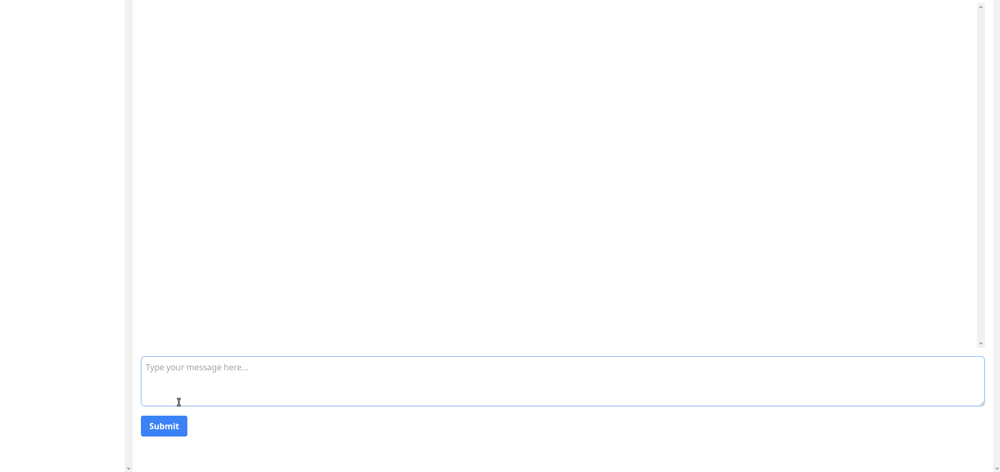

# llamallamallama

llamallamallama is a chat solution that allows users to chat with "Llama" fine tuned with LoRa on the "Alpaca" dataset. The solution uses SvelteKit to stream responses from a Python API to the browser.

The AI model was trained on the alpaca dataset [Alpaca Dataset](https://github.com/tatsu-lab/stanford_alpaca).

The model streaming logic was inspired by [Alpaca-LoRA-Serve](https://github.com/deep-diver/Alpaca-LoRA-Serve)

The project uses sqllite to store chat history.



## Installation

### Backend

To install the backend dependencies, run the following command:

`pip install -r requirements.txt` inside the backend directory.

You will need to add your models inside the `backend/models` folder.

```
.
├── llama-7b
└── llama-7b-ft
```

The fine tuned folder should have the `adapter_model.bin` and `adapter_config.json` files.

### Frontend

To install the frontend dependencies, run the following command:
`npm install`


## Usage

### Backend

To start the backend, run the following command:

`uvicorn main:app --reload`

This will start the backend server and make it available at http://localhost:8000.

### Frontend

To start the frontend in development.mode, run the following command:

`npm run dev`

This will start the frontend server and make it available at http://localhost:5173. You can then open this URL in a web browser to access the chat interface.

## Contributing

We welcome contributions to the llamallamallama project!

## License

llamallamallama is licensed under the MIT. See the [LICENSE](LICENSE) file for details.

## Credits

llamallamallama was created by rjmacarty with help from other repositories.

I will update this soon with all the credits.


## Todo

- Get model and weights from huggingface
- Docker
- Setup scripts
- Better UI
- Chat context
- Refactor
- Add tests
- Maintenance

- Better configuration options
